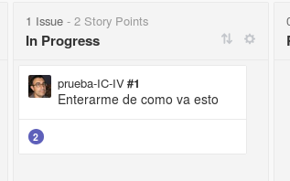
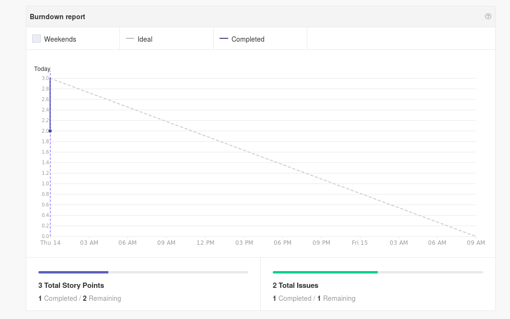
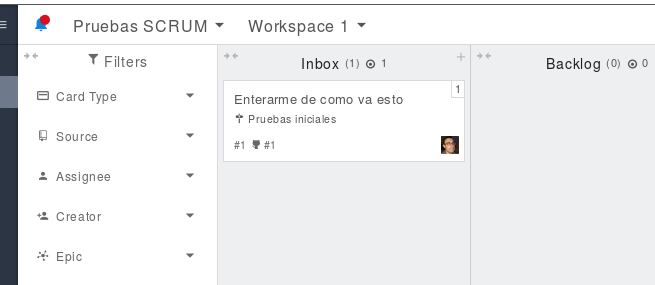

# Prueba de integración continua con IV

Repo para probar cosas de IV, como por
ejemplo [ZenHub](http://app.zenhub.com).

Pues va más o menos así:
 

 

Y he sacado el informe de Burndown:

 

## Probando otros sitios

Con Waffle.io no he logrado ni importar un repo. Vamos a probar con [Zube](https://zube.io)

 

## El proyecto estará escrito en Go o en Scala

Probablemente. Se almacenarán los datos inicialmente en texto plano,
más adelante se usará elastic o similar, con los logs por otro lado. 
